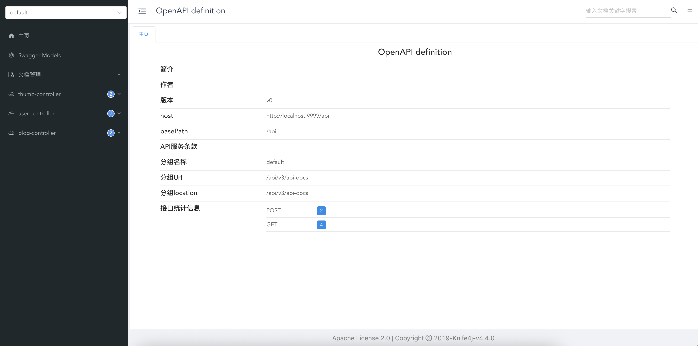

<h1 align="center" style="width: 60%; margin: auto; font-weight: 700; border: 0">高并发流量点赞系统</h1>
<h2 align="center" style="width: 20%; margin: auto; font-weight: 700; border: 0">初晨</h2> 

> 本项目主要是用于练习开发可支持高并发开发的项目，从最开始的点赞直接操作 MySql 到后面的加缓存 Redis，再到使用本地缓存 **Caffeine** 存热点 key 作进一步的优化，再到使用消息队列 **Pulsar** 进行解耦优化。最终达到单机版本达到支持高并发、高性能的点赞系统。

## 项目介绍

本项目是基于 Java21 的 SpringBoot3 项目，使用了许多 Java 新特性，如虚拟线程等。结合 Redis、Caffeine、Pulsar、MyBatis-plus、Docker 开发的高并发点赞系统，还运用了 Lua 保证多个 redis 命令的原子性。对于同一个接口保留了多种实现，可以轻松的切换使用不同的实现方法。最终可使用  JMeter 对本系统进行压力测试，在使用的服务器性能允许的前提下查看测试的结果的 TPS 等结果。

⚠️注意：本项目侧重于实践高并发系统的开发，所以这里只关注点赞和取消点赞接口的开发，包括登陆也只是使用的 ==spring-session-data-redis== 进行的一种简化的使用。使用 ==knife4j== 进行的接口管理测试，前端等模块都没有进行开发，可使用一些 AI 工具进行生成。

## 项目特点

- Java21 + SpringBoot3：使用了最新的 Java 特性（虚拟线程等），以及 SpringBoot3 的新开发特点。
- MyBatis-plus：简化了动态 SQL 的构建过程以及 CRUD 的操作。以及使用起插件进行基本的 CRUD 代码生成。
- Redis + Caffeine 构建多高性能多级缓存、通过热点缓存策略特高系统的性能。
- Pulsar 消息队列实现点赞请求的异步处理和批量消费，提高系统的吞吐量。
- 通过 Lua 操作 Redis 多条命令，保证 Redis 命令的原子性，以及减少网络 IO，提高系统响应速度。

## 测试运行

### 1、导入项目

通过以下命令克隆项目到本地然后用 IDEA 打开：

```shell
git clone git@github.com:timechuchen/cc-like.git
```

### 2、启动项目

1. 加载 Maven 依赖

2. 启动 MySql 服务并导入数据

   启动 MySql 服务并创建 `thumb` 库，然后运行  [create_table.sql](material/create_table.sql)  文件创建表结构

3. 启动 Redis 服务

4. 启动 Pulsar 消息队列服务

   可以通过 `docker` 来启动一个 Pulsar 服务：

   ```shell
   docker run -it \
   -p 6650:6650 \
   -p 8080:8080 \
   --mount source=pulsardata,target=/pulsar/data \
   --mount source=pulsarconf,target=/pulsar/conf \
   apachepulsar/pulsar:4.0.3 \
   bin/pulsar standalone
   ```

5. 更改配置文件

   更改 `application.yml` 中的配置信息。 

6. 启动项目启动类

   运行启动类 `CcLikeApplication` 启动本项目。

### 3、访问接口文档进行基本的接口测试

在本地启动的项目的话，可以直接访问 [http://localhost:9999/api/doc.html](http://localhost:9999/api/doc.html) 查看接口文档：



⚠️注意：测试点赞以及取消点赞之前要先运行一下登陆接口

### 4、压力测试

1. 官网下载  [JMeter](https://jmeter.apache.org/download_jmeter.cgi) 。

2. 为了测试更加真实，先运行测试类  [ThumbBackendApplicationTests.java](src/test/java/com/chuchen/cclike/ThumbBackendApplicationTests.java) 中的 `addUser` 方法生成一批用户；然后在运行`testLoginAndExportSessionToCsv ` 方法模拟等了脚本并且将登陆信息的 Session 信息存储到一个 **csv** 文件中以方便后续模拟真实用户的时候使用。

3. 启动 **JMeter** ，然后打开 [点赞系统.jmx](material/点赞系统.jmx) 配置文件导入对应配置（因为受本身服务器性能的影响，可先调整并发数的大小）。

   

4. 点击 `csv数据文件设置` 更改 csv 文件路径为刚才生成的 Session 的 csv 文件。

   

5. 然后点击运行就可以开始测试并查看结果

   

## 拓展优化

- [ ] 更改现在的单体 JVM 的锁改为用 Redis 实现分布式锁。
- [ ] 用 AI 生成简单的前端页面。
- [ ] 使用 [TiDB](https://github.com/pingcap/tidb) 代替 MySql 实现分布式数据库。
- [ ] 使用 Prometheus + Grafana 实现一个系统的可观测性架构。

